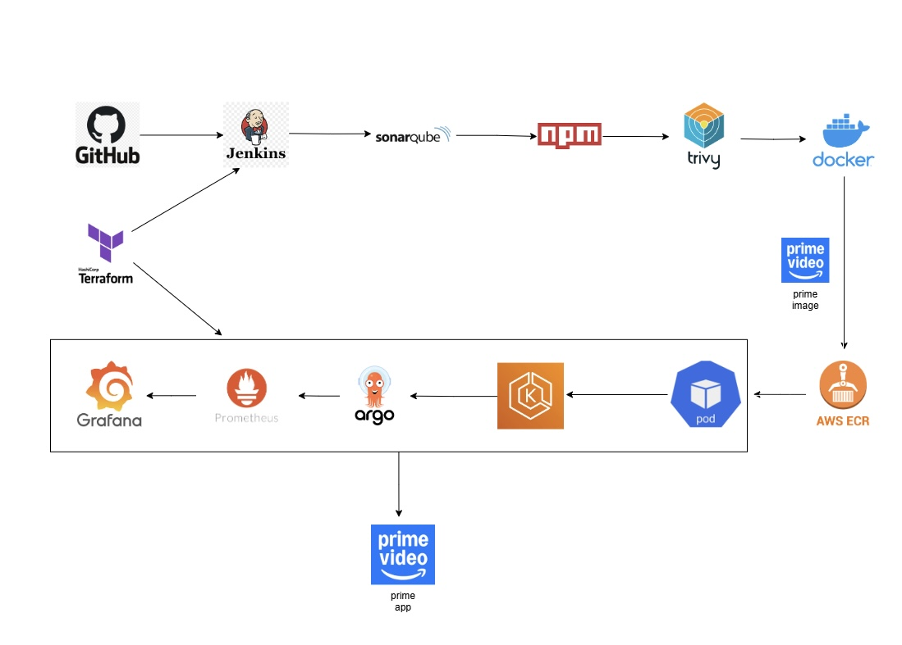

# Amazon Prime Clone Deployment Project


## Project Overview
This project demonstrates deploying an Amazon Prime clone using a set of DevOps tools and practices. The primary tools include:

- **Terraform**: Infrastructure as Code (IaC) tool to create AWS infrastructure such as EC2 instances and EKS clusters.
- **GitHub**: Source code management.
- **Jenkins**: CI/CD automation tool.
- **SonarQube**: Code quality analysis and quality gate tool.
- **NPM**: Build tool for NodeJS.
- **Aqua Trivy**: Security vulnerability scanner.
- **Docker**: Containerization tool to create images.
- **AWS ECR**: Repository to store Docker images.
- **AWS EKS**: Container management platform.
- **ArgoCD**: Continuous deployment tool.
- **Prometheus & Grafana**: Monitoring and alerting tools.

## Pre-requisites
1. **AWS Account**: Ensure you have an AWS account. [Create an AWS Account](https://docs.aws.amazon.com/accounts/latest/reference/manage-acct-creating.html)
2. **AWS CLI**: Install AWS CLI on your local machine. [AWS CLI Installation Guide](https://docs.aws.amazon.com/cli/latest/userguide/getting-started-install.html)
3. **VS Code (Optional)**: Download and install VS Code as a code editor. [VS Code Download](https://code.visualstudio.com/download)
4. **Install Terraform in Windows**: Download and install Terraform in Windows [Terraform in Windows](https://learn.microsoft.com/en-us/azure/developer/terraform/get-started-windows-bash)

## Configuration
### AWS Setup
1. **IAM User**: Create an IAM user and generate the access and secret keys to configure your machine with AWS.
2. **Key Pair**: Create a key pair named `key` for accessing your EC2 instances.

## Infrastructure Setup Using Terraform
1. **Clone the Repository** (Open Command Prompt & run below):
   ```bash
   git clone https://github.com/pandacloud1/DevopsProject2.git
   cd DevopsProject2
   code .   # this command will open VS code in backend
   ```
2. **Initialize and Apply Terraform**:
   - Run the below commands to reduce the path displayed in VS Code terminal (Optional)
     ```bash
     code $PROFILE
     function prompt {"$PWD > "}
     function prompt {$(Get-Location -Leaf) + " > "}
     ```
   - Open `terraform_code/ec2_server/main.tf` in VS Code.
   - Run the following commands:
     ```bash
     aws configure
     terraform init
     terraform apply --auto-approve
     ```

This will create the EC2 instance, security groups, and install necessary tools like Jenkins, Docker, SonarQube, etc.

## SonarQube Configuration
1. **Login Credentials**: Use `admin` for both username and password.
2. **Generate SonarQube Token**:
   - Create a token under `Administration → Security → Users → Tokens`.
   - Save the token for integration with Jenkins.

## Jenkins Configuration
1. **Add Jenkins Credentials**:
   - Add the SonarQube token, AWS access key, and secret key in `Manage Jenkins → Credentials → System → Global credentials`.
2. **Install Required Plugins**:
   - Install plugins such as SonarQube Scanner, NodeJS, Docker, and Prometheus metrics under `Manage Jenkins → Plugins`.

3. **Global Tool Configuration**:
   - Set up tools like JDK 17, SonarQube Scanner, NodeJS, and Docker under `Manage Jenkins → Global Tool Configuration`.

## Pipeline Overview
### Pipeline Stages
1. **Git Checkout**: Clones the source code from GitHub.
2. **SonarQube Analysis**: Performs static code analysis.
3. **Quality Gate**: Ensures code quality standards.
4. **Install NPM Dependencies**: Installs NodeJS packages.
5. **Trivy Security Scan**: Scans the project for vulnerabilities.
6. **Docker Build**: Builds a Docker image for the project.
7. **Push to AWS ECR**: Tags and pushes the Docker image to ECR.
8. **Image Cleanup**: Deletes images from the Jenkins server to save space.

### Running Jenkins Pipeline
Create and run the build pipeline in Jenkins. The pipeline will build, analyze, and push the project Docker image to ECR.
Create a Jenkins pipeline by adding the following script:

### Build Pipeline

```groovy
pipeline {
    agent any
    
    tools {
        jdk 'JDK'
        nodejs 'NodeJS'
    }

    environment {
        SCANNER_HOME = tool 'SonarQube Scanner'
    }

    parameters {
        string(
            name: 'ECR_REPO_NAME',
            defaultValue: 'amazon-prime',
            description: 'Enter your ECR repository name'
        )
        string(
            name: 'AWS_ACCOUNT_ID',
            defaultValue: '',
            description: 'Enter your AWS Account ID'
        )
    }

    stages {
        stage('Checkout') {
            steps {
                git branch: 'main', url: 'https://github.com/pandacloud1/DevopsProject2.git'
            }
        }

        stage('SonarQube Analysis') {
            steps {
                withSonarQubeEnv('sonar-server') {
                    sh """
                        ${SCANNER_HOME}/bin/sonar-scanner \
                        -Dsonar.projectName=amazon-prime \
                        -Dsonar.projectKey=amazon-prime \
                        -Dsonar.sources=.
                    """
                }
            }
        }

        stage('SonarQube Quality Gate') {
            steps {
                timeout(time: 1, unit: 'MINUTES') {
                    waitForQualityGate abortPipeline: false, credentialsId: 'sonar-token'
                }
            }
        }

        stage('NPM Install') {
            steps {
                sh 'npm install'
            }
        }

        stage('Trivy Scan') {
            steps {
                sh 'trivy fs . > trivy-scan-results.txt'
            }
        }

        stage('Docker Image Build') {
            steps {
                sh "docker build -t ${params.ECR_REPO_NAME} ."
            }
        }

        stage('Create ECR Repo') {
            steps {
                withCredentials([
                    string(credentialsId: 'access-key', variable: 'AWS_ACCESS_KEY'), 
                    string(credentialsId: 'secret-key', variable: 'AWS_SECRET_KEY')
                ]) {
                    sh """
                        export AWS_ACCESS_KEY_ID=${AWS_ACCESS_KEY}
                        export AWS_SECRET_ACCESS_KEY=${AWS_SECRET_KEY}

                        aws ecr describe-repositories --repository-names ${params.ECR_REPO_NAME} --region us-east-1 >/dev/null 2>&1 || \\
                        aws ecr create-repository --repository-name ${params.ECR_REPO_NAME} --region us-east-1
                    """
                }
            }
        }

        stage('ECR Login & Tag Image') {
            steps {
                withCredentials([
                    string(credentialsId: 'access-key', variable: 'AWS_ACCESS_KEY'),
                    string(credentialsId: 'secret-key', variable: 'AWS_SECRET_KEY')
                ]) {
                    sh """
                        export AWS_ACCESS_KEY_ID=${AWS_ACCESS_KEY}
                        export AWS_SECRET_ACCESS_KEY=${AWS_SECRET_KEY}

                        aws ecr get-login-password --region us-east-1 | docker login --username AWS --password-stdin ${params.AWS_ACCOUNT_ID}.dkr.ecr.us-east-1.amazonaws.com

                        docker tag ${params.ECR_REPO_NAME} ${params.AWS_ACCOUNT_ID}.dkr.ecr.us-east-1.amazonaws.com/${params.ECR_REPO_NAME}:$BUILD_NUMBER
                        
                        docker tag ${params.ECR_REPO_NAME} ${params.AWS_ACCOUNT_ID}.dkr.ecr.us-east-1.amazonaws.com/${params.ECR_REPO_NAME}:latest
                    """
                }
            }
        }

        stage('Push Image to ECR') {
            steps {
                withCredentials([
                    string(credentialsId: 'access-key', variable: 'AWS_ACCESS_KEY'),
                    string(credentialsId: 'secret-key', variable: 'AWS_SECRET_KEY')
                ]) {
                    sh """
                        export AWS_ACCESS_KEY_ID=${AWS_ACCESS_KEY}
                        export AWS_SECRET_ACCESS_KEY=${AWS_SECRET_KEY}

                        docker push ${params.AWS_ACCOUNT_ID}.dkr.ecr.us-east-1.amazonaws.com/${params.ECR_REPO_NAME}:$BUILD_NUMBER
                        
                        docker push ${params.AWS_ACCOUNT_ID}.dkr.ecr.us-east-1.amazonaws.com/${params.ECR_REPO_NAME}:latest
                    """
                }
            }
        }

        stage('Cleanup Docker Images') {
            steps {
                sh """
                    docker rmi -f ${params.AWS_ACCOUNT_ID}.dkr.ecr.us-east-1.amazonaws.com/${params.ECR_REPO_NAME}:$BUILD_NUMBER || true
                    docker rmi -f ${params.AWS_ACCOUNT_ID}.dkr.ecr.us-east-1.amazonaws.com/${params.ECR_REPO_NAME}:latest || true
                    docker rmi -f ${params.ECR_REPO_NAME} || true
                """
            }
        }
    }
}

```

## Continuous Deployment with ArgoCD
1. **Create EKS Cluster**: Use Terraform to create an EKS cluster and related resources.
2. **Deploy Amazon Prime Clone**: Use ArgoCD to deploy the application using Kubernetes YAML files.
3. **Monitoring Setup**: Install Prometheus and Grafana using Helm charts for monitoring the Kubernetes cluster.

### Deployment Pipeline
```groovy
pipeline {
    agent any

    environment {
        KUBECTL = '/usr/local/bin/kubectl'
        AWS_ACCESS_KEY_ID = credentials('access-key')   // Jenkins credentials ID for AWS Access Key
        AWS_SECRET_ACCESS_KEY = credentials('secret-key')  // Jenkins credentials ID for AWS Secret Key
        AWS_DEFAULT_REGION = 'us-east-1'
    }

    parameters {
        string(name: 'CLUSTER_NAME', defaultValue: 'amazon-prime-cluster', description: 'Enter your EKS cluster name')
    }

    stages {
        stage("Login to EKS") {
            steps {
                script {
                    sh "aws eks --region ${env.AWS_DEFAULT_REGION} update-kubeconfig --name ${params.CLUSTER_NAME}"
                }
            }
        }

        stage("Configure Prometheus & Grafana") {
            steps {
                script {
                    sh """
                    helm repo add stable https://charts.helm.sh/stable || true
                    helm repo add prometheus-community https://prometheus-community.github.io/helm-charts || true
                    helm repo update

                    if ${KUBECTL} get namespace prometheus > /dev/null 2>&1; then
                        helm upgrade kube-prometheus prometheus-community/kube-prometheus-stack -n prometheus --wait
                    else
                        ${KUBECTL} create namespace prometheus
                        helm install kube-prometheus prometheus-community/kube-prometheus-stack -n prometheus --wait
                    fi

                    echo "Listing services in prometheus namespace:"
                    ${KUBECTL} get svc -n prometheus

                    echo "Patching Prometheus service to LoadBalancer"
                    ${KUBECTL} patch svc kube-prometheus-stack-prometheus -n prometheus -p '{"spec": {"type": "LoadBalancer"}}' || echo "Prometheus service patch failed"

                    echo "Patching Grafana service to LoadBalancer"
                    ${KUBECTL} patch svc kube-prometheus-stack-grafana -n prometheus -p '{"spec": {"type": "LoadBalancer"}}' || echo "Grafana service patch failed"
                    """
                }
            }
        }

        stage("Configure ArgoCD") {
            steps {
                script {
                    sh """
                    kubectl create namespace argocd || true
                    kubectl apply -n argocd -f https://raw.githubusercontent.com/argoproj/argo-cd/stable/manifests/install.yaml
                    kubectl patch svc argocd-server -n argocd -p '{"spec": {"type": "LoadBalancer"}}'
                    """
                }
            }
        }
    }
}
```

## Cleanup
- Run cleanup pipelines to delete the resources such as load balancers, services, and deployment files.
- Use `terraform destroy` to remove the EKS cluster and other infrastructure.

### Cleanup Pipeline
```groovy
pipeline {
    agent any

    parameters {
        string(name: 'CLUSTER_NAME', defaultValue: 'amazon-prime-cluster', description: 'EKS cluster name')
    }

    stages {
        stage('Setup AWS and Kubeconfig') {
            steps {
                withCredentials([
                    string(credentialsId: 'access-key', variable: 'AWS_ACCESS_KEY_ID'),
                    string(credentialsId: 'secret-key', variable: 'AWS_SECRET_ACCESS_KEY')
                ]) {
                    sh '''
                        export AWS_ACCESS_KEY_ID=$AWS_ACCESS_KEY_ID
                        export AWS_SECRET_ACCESS_KEY=$AWS_SECRET_ACCESS_KEY
                        export AWS_DEFAULT_REGION=us-east-1
                        echo "[*] Updating kubeconfig for cluster $CLUSTER_NAME"
                        aws eks update-kubeconfig --region $AWS_DEFAULT_REGION --name $CLUSTER_NAME
                    '''
                }
            }
        }

        stage('Cleanup Kubernetes Resources') {
            steps {
                withCredentials([
                    string(credentialsId: 'access-key', variable: 'AWS_ACCESS_KEY_ID'),
                    string(credentialsId: 'secret-key', variable: 'AWS_SECRET_ACCESS_KEY')
                ]) {
                    sh '''
                        export AWS_ACCESS_KEY_ID=$AWS_ACCESS_KEY_ID
                        export AWS_SECRET_ACCESS_KEY=$AWS_SECRET_ACCESS_KEY
                        export AWS_DEFAULT_REGION=us-east-1

                        echo "[*] Deleting deployment and services"
                        kubectl delete deploy pandacloud-app --ignore-not-found
                        kubectl delete svc pandacloud-app --ignore-not-found

                        echo "[*] Deleting ArgoCD resources"
                        kubectl delete -n argocd -f https://raw.githubusercontent.com/argoproj/argo-cd/stable/manifests/install.yaml --ignore-not-found
                        kubectl delete namespace argocd --ignore-not-found

                        echo "[*] Deleting prometheus Helm release and namespace"
                        helm uninstall kube-stack -n prometheus || true
                        kubectl delete namespace prometheus --ignore-not-found

                        echo "[*] Removing Helm repos"
                        helm repo remove stable || true
                        helm repo remove prometheus-community || true
                    '''
                }
            }
        }

        stage('Delete ECR Repository and KMS Keys') {
            steps {
                withCredentials([
                    string(credentialsId: 'access-key', variable: 'AWS_ACCESS_KEY_ID'),
                    string(credentialsId: 'secret-key', variable: 'AWS_SECRET_ACCESS_KEY')
                ]) {
                    sh '''
                        export AWS_ACCESS_KEY_ID=$AWS_ACCESS_KEY_ID
                        export AWS_SECRET_ACCESS_KEY=$AWS_SECRET_ACCESS_KEY
                        export AWS_DEFAULT_REGION=us-east-1

                        echo "[*] Deleting ECR repository"
                        aws ecr delete-repository --repository-name amazon-prime --region $AWS_DEFAULT_REGION --force || true

                        echo "[*] Scheduling deletion of KMS keys"
                        for key in $(aws kms list-keys --region $AWS_DEFAULT_REGION --query "Keys[*].KeyId" --output text); do
                            aws kms disable-key --key-id $key --region $AWS_DEFAULT_REGION || true
                            aws kms schedule-key-deletion --key-id $key --pending-window-in-days 7 --region $AWS_DEFAULT_REGION || true
                        done
                    '''
                }
            }
        }
    }
}

```

## Additional Information
For further details, refer to the word document containing a complete write-up of the project.

---
